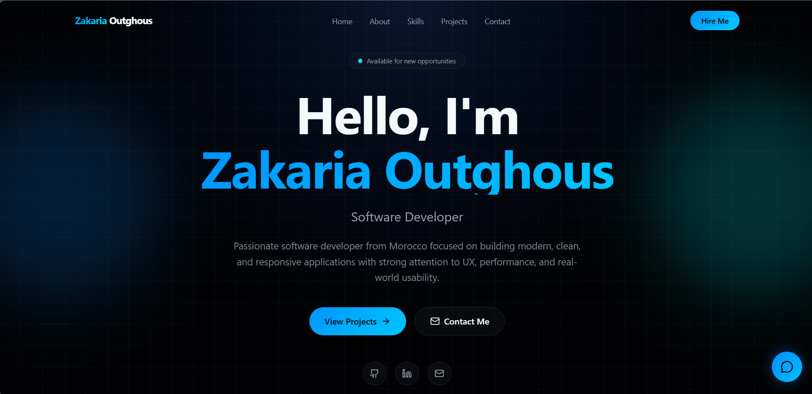

# 🌐 Personal Portfolio Website

## 🚀 Live Website
👉 https://zakaria-outghous-portfolio.lovable.app/

---

## 💡 About the Project
This is my personal developer portfolio built using Lovable.  
It showcases my skills, projects, and contact information in a clean modern design.

---

## 🎯 Purpose
The goal of this portfolio is to present myself professionally as a developer and provide a central place to showcase my work.

---

## 🧠 Features
- Modern UI/UX design
- Responsive (mobile friendly)
- Projects showcase section
- Contact & social links
- Clean and minimal design

---

## 🛠 Built With
- Lovable AI
- UI Design Tools
- Web deployment platform

---

## 📸 Preview

---

## 🔗 Live Demo
👉 Click here: https://zakaria-outghous-portfolio.lovable.app/
